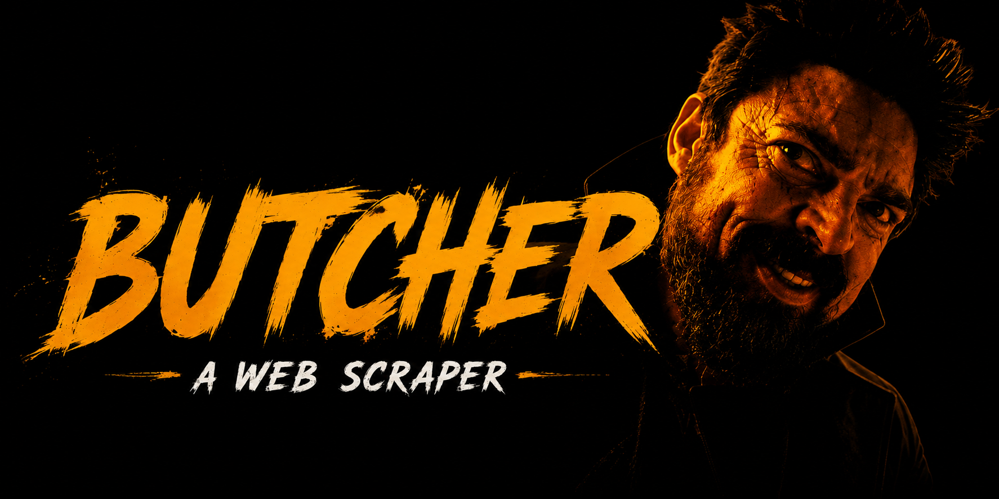
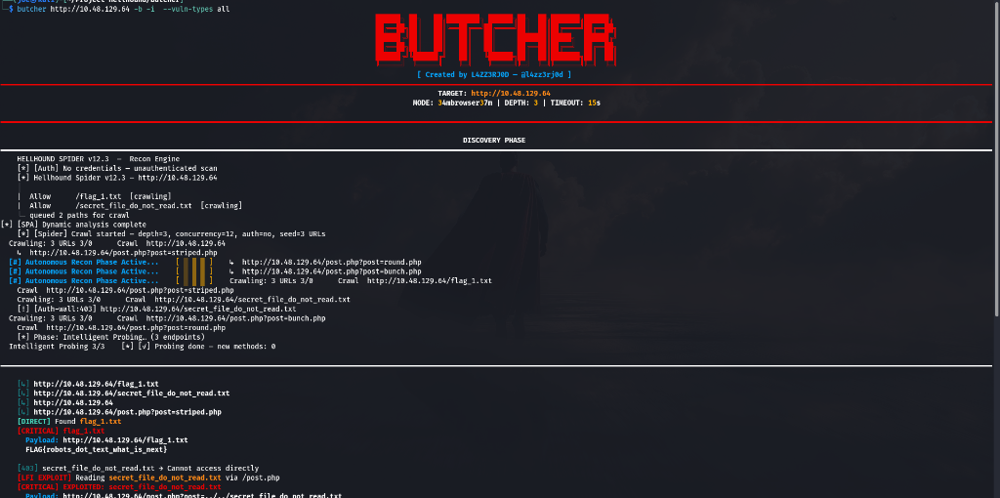
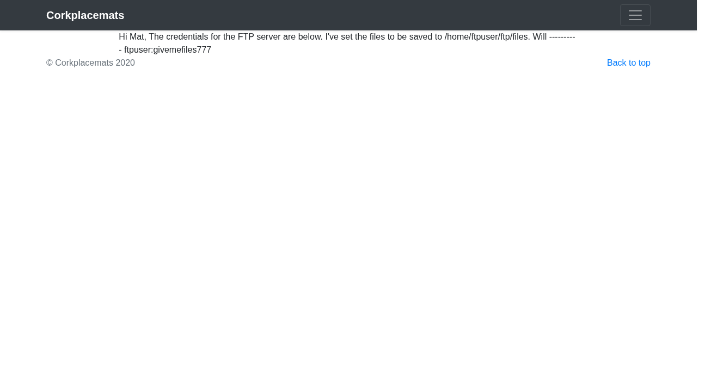

<p align="center">
  
</p>

<h1 align="center">Butcher</h1>

<p align="center">
  Surgical Web Scraper — Deep extraction, headless rendering, and pattern-based harvesting for high-fidelity data intelligence.
</p>

<p align="center">
  
  
  
  
</p>

## Features
- **Surgical Matrix UI**: Sharp, high-fidelity ANSI interface with zero-latency telemetry and dynamic width scaling.
- **No Green Policy**: Strictly technical color palette (Red, Yellow, Cyan) for maximum tactical focus.
- **Hellhound-Spider Recon**: Autonomous surface mapping phase powered by the integrated Spider engine.
- **Dual-Phase Workflow**: Discovery of hidden endpoints followed by surgical data carving.
- **Automated Reporting**: Intelligent file naming and high-fidelity risk scoring.

## Installation
```bash
bash install.sh
```

<p align="center">
  
</p>

## Usage
Butcher follows a two-phase surgical workflow:

1. **Recon Phase**: It invokes the `Hellhound-Spider` to map the target's attack surface and ingest all accessible endpoints.
2. **Extraction Phase**: It carves through the discovered endpoints to extract high-value intelligence.

### Examples
```bash
# Basic extraction with automated report naming
butcher https://target.com --extract emails,api_keys

# Heavy recon with headless browser and deep crawling
butcher https://target.com --browser --depth 1 --max-pages 20

# Stealth extraction excluding specific sensitive paths
butcher https://target.com --exclude "logout,delete" --output-format quiet
```

### Setup Environment

Butcher is designed to run in an isolated environment to ensure stability and dependency integrity.

```bash
git clone git@github.com:project-hellhound-org/butcher.git
cd butcher
chmod +x install.sh
./install.sh
```

The installer configures the virtual environment and installs the necessary headless browser binaries.

### Update

To pull the latest surgical patterns and core updates:

```bash
./update.sh
```

---

## Tactical Features

Butcher provides surgical precision in web scraping, designed to handle modern, complex web applications:

1.  **Headless Orchestration**: Leverages Playwright for full DOM rendering, ensuring that JavaScript-heavy SPAs are fully executed before extraction.
2.  **Surgical Extraction**: Define precise CSS or XPath patterns to "carve" data out of complex structures with zero noise.
3.  **Pattern Harvesting**: Automatically identifies and extracts repeating data patterns (products, articles, profiles) without manual configuration.
4.  **Anti-Detection Engine**: Integrated rotation of User-Agents, headers, and proxies to bypass WAFs and bot detection mechanisms.
5.  **Multi-Threaded Concurrency**: High-performance worker pool for rapid scraping across thousands of endpoints.

---

## What It Does

Butcher is not a generic crawler; it is a surgical instrument for data extraction. It excels at mapping out the internal structure of a site and extracting high-value intelligence with structured output.

By combining the raw speed of `aiohttp` with the rendering capabilities of `Playwright`, Butcher ensures that no data is left behind, even if it's buried deep within asynchronous fetches or shadow DOMs.

---

## Usage

```bash
butcher <target> [options]
```

**Extraction Options**

| Flag | Default | Description |
|---|---|---|
| `-p`, `--pattern` | | Specific CSS/XPath pattern to extract |
| `-t`, `--threads` | `10` | Concurrent scraping workers |
| `--timeout` | `10` | Request timeout in seconds |

**Output Options**

| Flag | Description |
|---|---|
| `-o`, `--output` | Save results to JSON or CSV |
| `-v`, `--verbose` | Enable real-time extraction logs |

---

## Examples

```bash
# Standard scrape with automatic pattern discovery
butcher https://target.com

# Surgical extraction of specific elements
butcher https://target.com --pattern ".product-title"

# High-concurrency scraping with output
butcher https://target.com -t 50 -o results.json
```

## Evidence & Validation
Butcher provides verified attack chains and visual proofs for every finding.

<p align="center">
  
</p>

---

## Requirements

- Python 3.10+
- `playwright`, `aiohttp`, `beautifulsoup4`
- Chromium/Firefox binaries

---

## Legal

For authorized data extraction and research purposes only. The authors are not responsible for misuse or violation of any site's Terms of Service. Licensed under the **GNU General Public License v3 (GPLv3)**.